### 向量 

在线性代数中,我们通常将向量看作一个**空间中从原点出发的带方向和距离的箭头**.

并将其记作一个列矩阵,如下图二维向量记作$\begin{bmatrix} 2\\ 1\\ \end{bmatrix} $

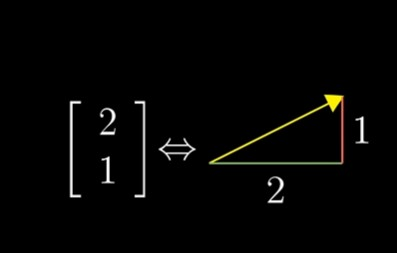

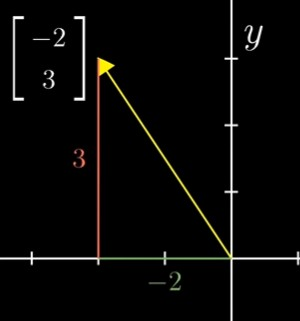

这个矩阵指导你如何从向量原点(向量起点)到达它的尖端(向量终点),如上图,第一个数表示沿x轴走-2,第二个数表示再沿y轴走3.

### 向量加法

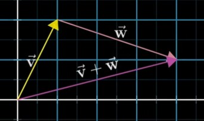

两向量相加,图像上描述从原点出发先沿 $\overrightarrow{V}$移动,再从其尖端(向量终点)按照$\overrightarrow{W}$移动,最终连接其起点和终点,得到相加的向量.数值上表示为各自分量相加.

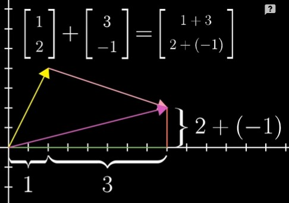

### 数乘

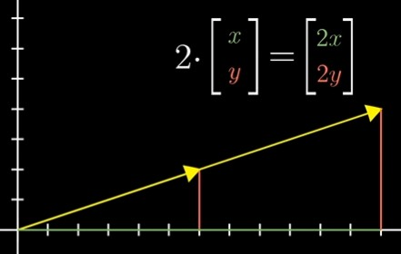

不改变方向,将向量缩放数倍,数值上就是将矩阵内的各个分量与标量相乘

### 基,张量空间,线性组合

在二维坐标空间中,我们把朝y正方向的单位坐标记为$\hat{j}$,把朝向x正方向的单位坐标记为$\hat i$,我们称其为xy坐标系的**基向量**

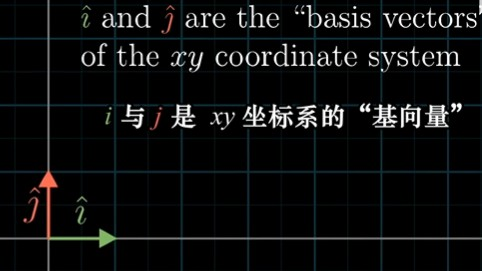

且这个坐标系的向量,都可以表示为两个基向量的数乘相加来表示.

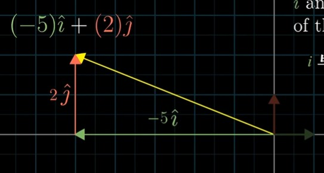

同时,我们将这样两个向量的乘法之和称为两个向量的**线性组合**

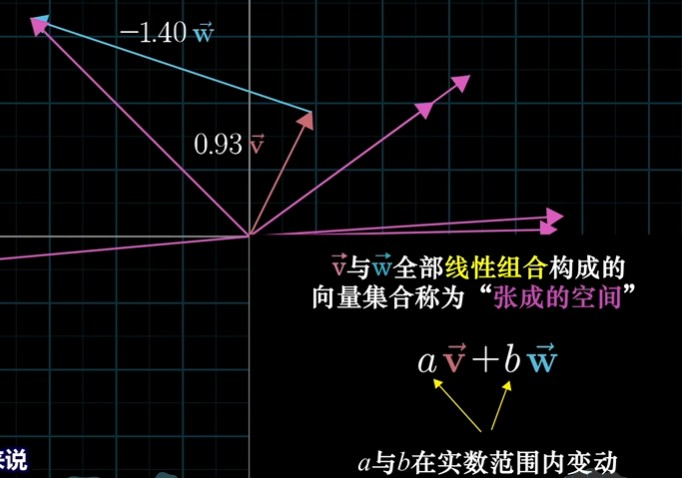

由空间内任意两个向量的全部线性组合构成的向量集合,称为"张成的空间"(span).

一般的,在二维空间内任意两个向量的线性组合,可以表示二维空间内所有向量,他们张成的空间是无限大的二维平面.

这里需要强调一点,在线性代数中,我们默认**所有向量是从原点出发的一个有长度的箭头**(除了计算加法时可以平移)

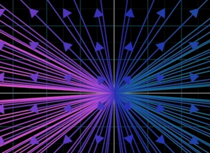

因此我们可以将**所有向量抽象成其端点**(向量终点).

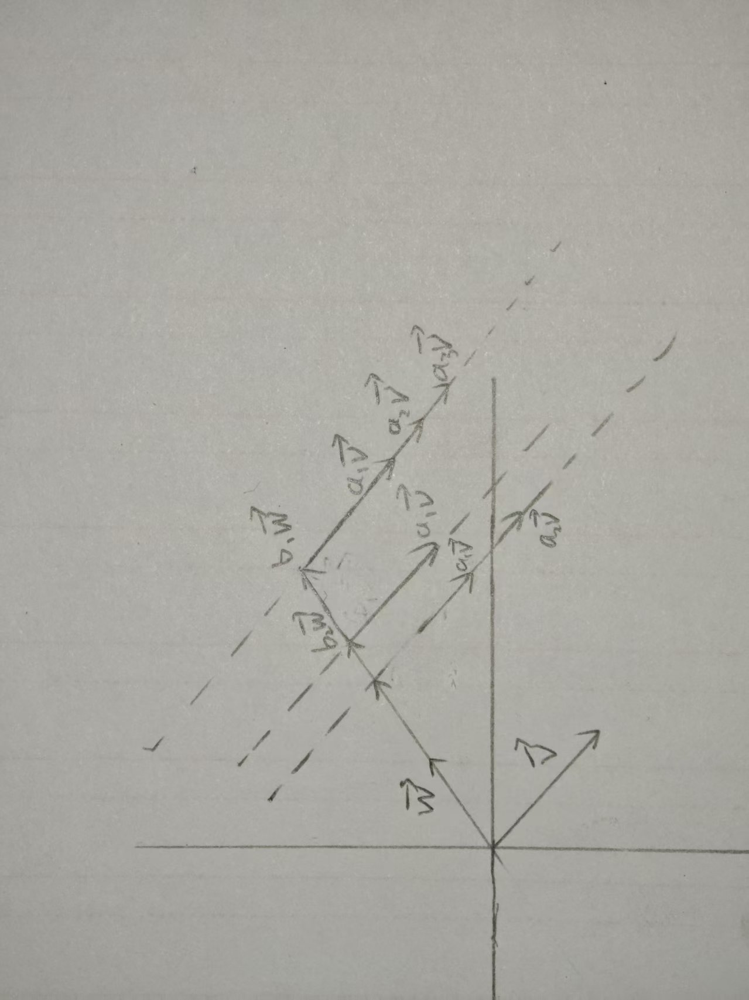

如上图,想象一下在固定$\vec w$系数$b_1$的情况下,与不同系数的$\vec v$的线性组合,他们的向量集合(也就是他们的端点),将会铺满一条直线;

再跟不同系数的$\vec w$线性组合,相当于不断地在平移这条直线,这样所有的线性组合出来的向量的端点,将会铺满整个二维平面!

但是,如果两个向量共线,他们张成的空间将只会在一条直线上;(我们称其为**线性相关**)

将其推广到三维空间,同理:

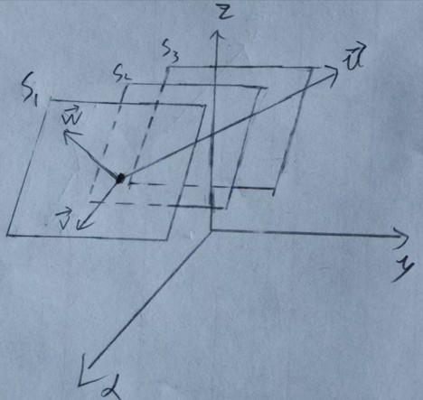
$$
两个不共线的向量:\vec v 与\vec w,其线性组合构成了无限扩张的二维平面S_1,即其线性组合的向量的端点(向量终点),可以铺满整个平面,\\
此时再给出一个不在此平面的向量 \vec u,与其线性组合的向量的端点,就能表示整个三维空间的所有点;\\
你可以想象成将平面空间S_1,不断沿着\vec u方向平移扩张的效果,最终这无限多个平面,就能铺满整个三维空间\\
$$
如果$\vec u$在$S_1$平面上,则他们的线性组合的向量将无法超出平面范围,就属于线性相关,此时,$\vec u$可以用$\vec v,\vec w$的线性组合表示出来

### 总结

* 线性无关:如果线性组合的所有向量,都给张成的空间增添了新维度,就称他们线性无关(如两个非共线的向量构成二维平面,三个不共面向量构成三维平面)
* 基的严格定义:向量空间的一个基是张成该空间的一个线性无关向量集

任意n个线性无关的向量,都能构成n维空间,但一般的,我们都是采用的以x,y,z正方向的三个单位向量为基向量,来表示一个三维向量空间.
