Unfortunately,no one can be told what the **Matrix** is .You have to see it for yourself.-Morpheus

很遗憾,矩阵是什么是说不清的.你必须得自己亲眼看看-墨菲斯(骇客帝国) 

### 变换

 变换,本质上就是函数,我们输入一个向量,然后输出一个向量.

使用变换一词,旨在说明以特定方式可视化输入-输出的关系

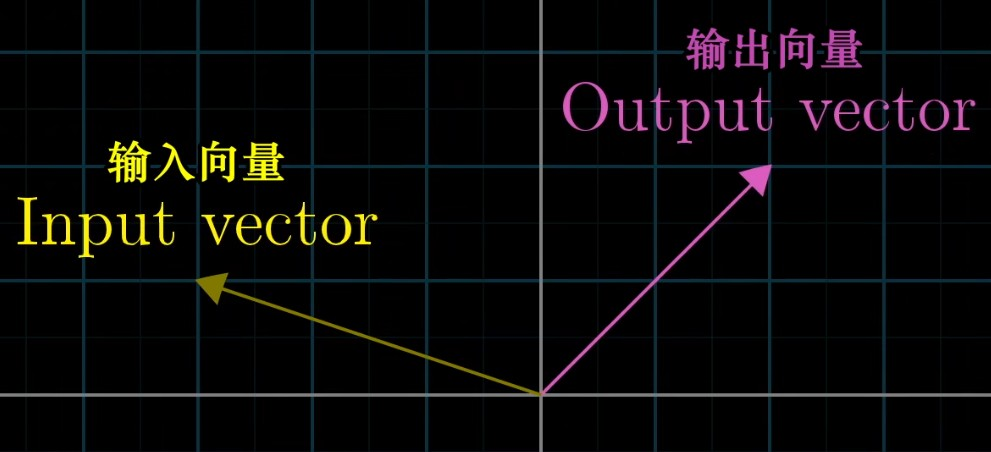

而整个变换的意思,我们可以想象成每个输入的向量都经过变换移动到对应输出的向量位置(如下图,这里用点代表每个从原点到端点的向量)

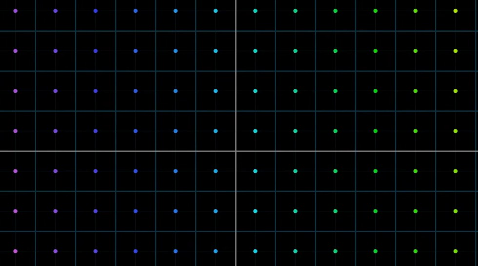

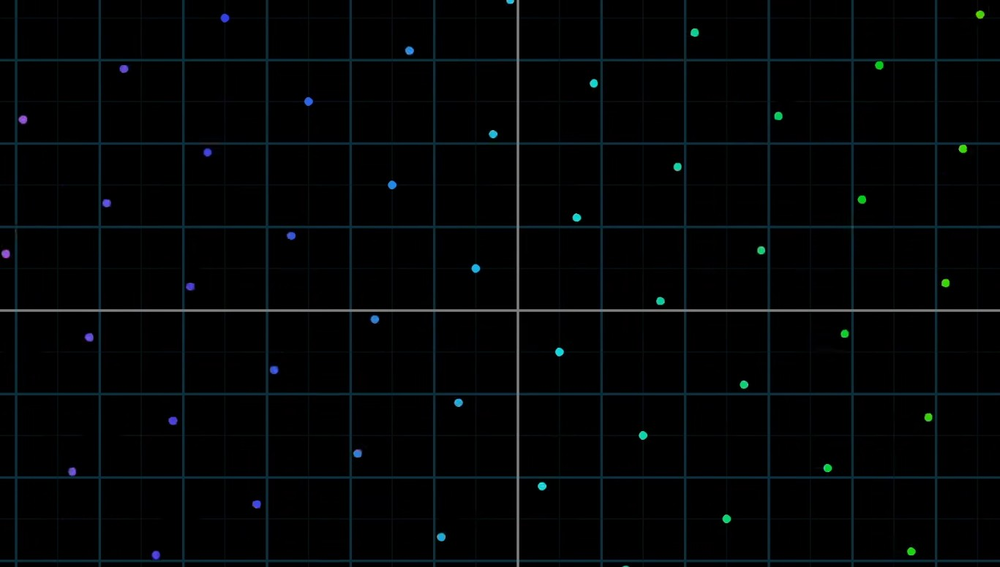

如上图,标准空间下所有向量,被倾斜拉升到其他位置

### 线性变换

定义:1.变换后直线依旧是直线.2.原点保持固定(如下图,灰白是原始空间标准的网格,变换到蓝色拉伸的网格)

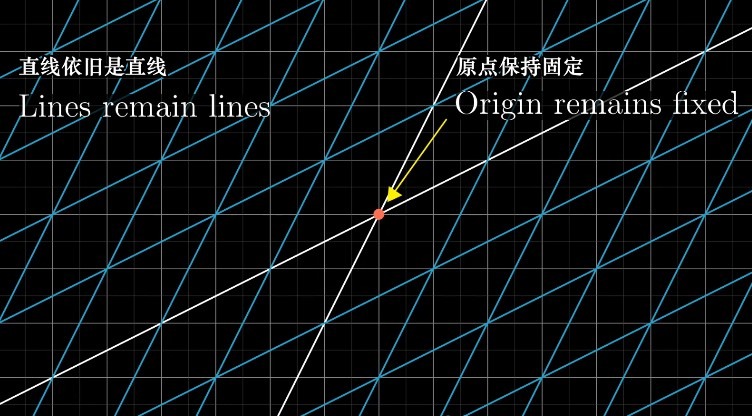

或者说,把线性变换看成"保持网格线平行等距分布"的变换.

### 如何描述线性变换

首先我们知道,**空间向量等价于向量分量对其基向量的线性组合**这一思想

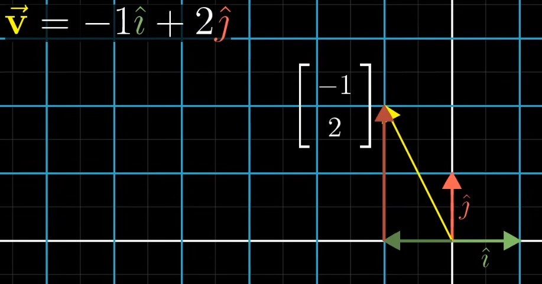

变换后也同样如此,向量数值并未变化,但是其基向量构成的空间变了,最终求得$\vec v$,变换到了原空间坐标(5,2)的位置,但相对与新的基向量仍是(-1,2)(朝新的$\hat i$走-1单位,再朝新的$\hat j$走两个单位)

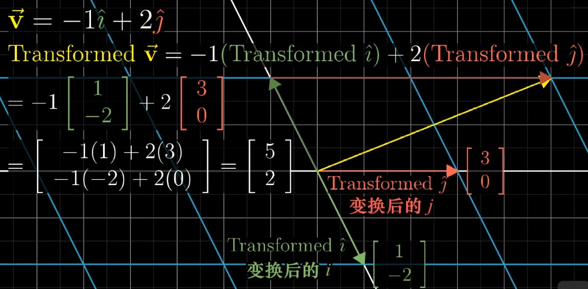

通过这个公式我们就能求得一切变换后的向量位置;

概括下来,我们将这两个基向量包装到2x2数表中,称为2x2矩阵

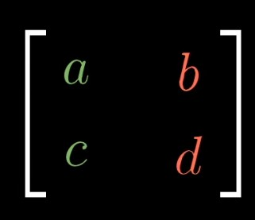

它描述了一个线性变换信息:第一列(a,c)看成第一个基向量,第二列(b,d)为第二个基向量;

当我们把其作用于任意初始向量(x,y),就有

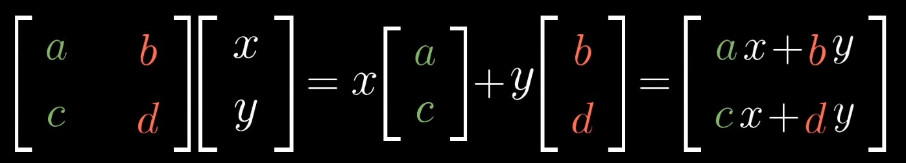

就能得到变换后的(x,y)向量

### 案例

现在来看一个逆时针旋转90度的矩阵:

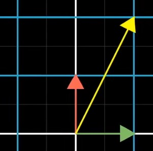

想算出如图标准空间下黄色向量(1,2)逆时针旋转90度的位置;

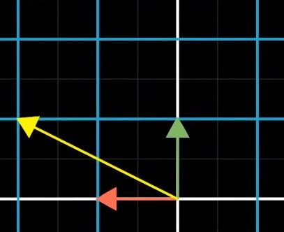

我们只需要通过变换后的基向量组成2x2变换矩阵(此时基向量1变成(0,1),基向量2变成(-1,0)),对初始向量进行运算即可得到旋转后的结果:如图,初始黄色向量为(1,2),逆时针90度变换后为计算结果为(-2,1)
$$
\begin{bmatrix} 
0&-1\\ 
1&0\\ 
\end{bmatrix}
\begin{bmatrix} 
x(1)\\ 
y(2)\\ 
\end{bmatrix}
=\begin{bmatrix} 
-2\\ 
1\\ 
\end{bmatrix}
$$

---

### 案例2

现在给出一个变换$\begin{bmatrix} 
1&3\\ 
2&1\\ 
\end{bmatrix}$,能表述出其变换吗?

首先我们给出原式空间以及其基向量

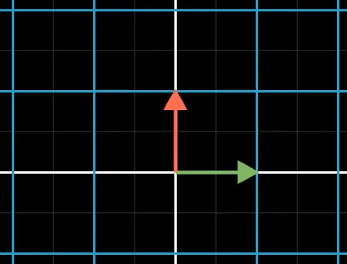

基向量1(绿色)由$\begin{bmatrix} 1\\ 0\\ \end{bmatrix}$变换到$\begin{bmatrix} 1\\ 2\\ \end{bmatrix}$,如下图,我们能看到带动整个空间网格发生的改变

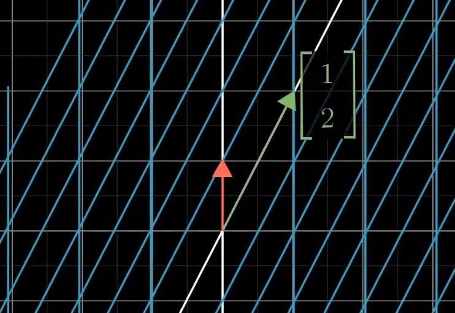

基向量2(红色)由$\begin{bmatrix} 0\\ 1\\ \end{bmatrix}$变换到$\begin{bmatrix} 3\\ 1\\ \end{bmatrix}$,想象成整个平面以向量$\begin{bmatrix} 1\\ 2\\ \end{bmatrix}$为轴翻转180度,此时基向量2(红)就来到了基向量1(绿)的下方,最后拉伸得到结果(动画参考3b1b矩阵与线性变换一节)

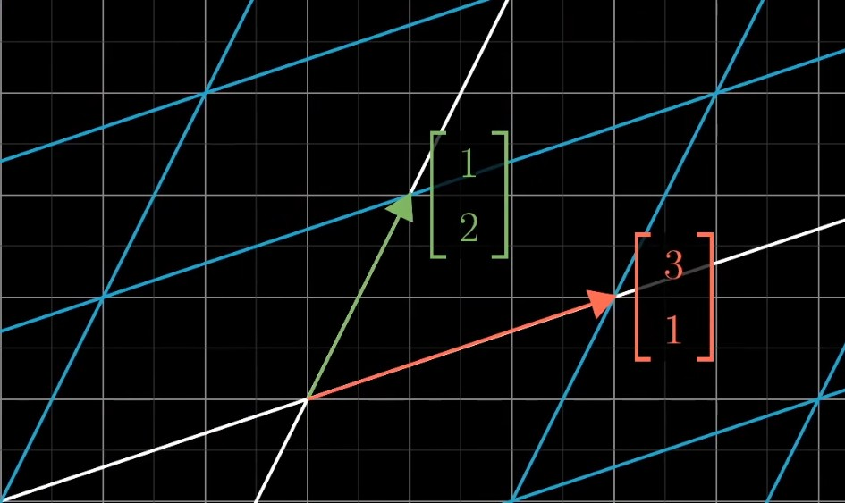