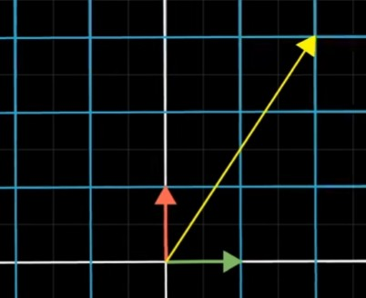
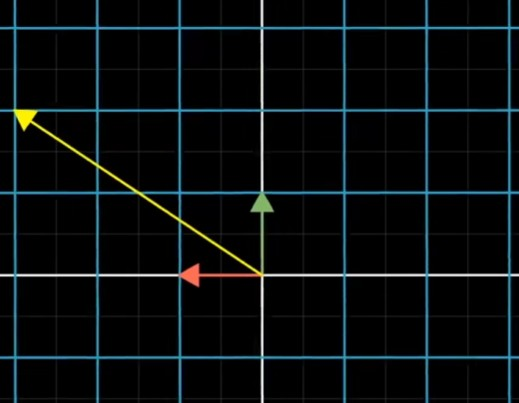
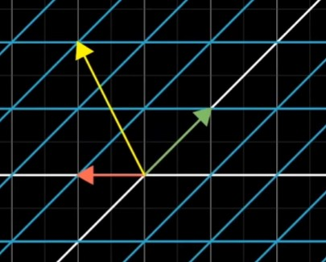
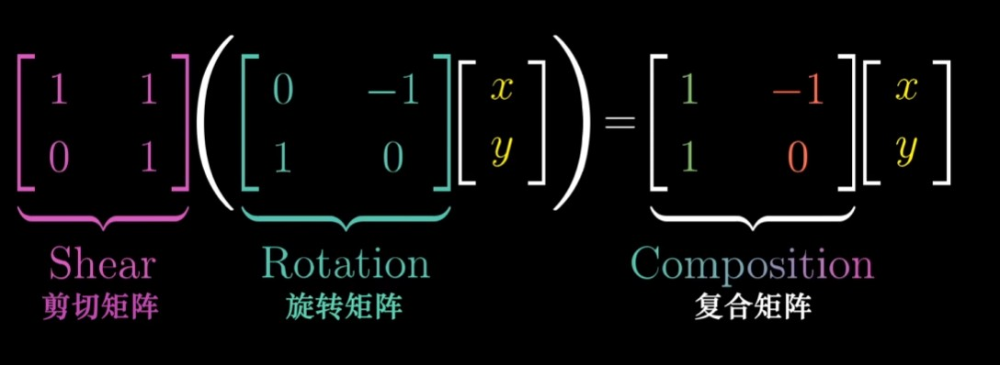

现在我们想让一个标准向量,先进行逆时针旋转90度变换

再进行一个剪切拉伸变换

形成的这个新的线性变换称为前两个独立变换的"复合变换"

我们同样用基向量$\hat i和\hat j$来表示,如图所示$\hat i$端点落在$\begin{bmatrix} 1\\ 1\\ \end{bmatrix}$,$\hat j$端点落在$\begin{bmatrix} 
-1\\ 
0\\ 
\end{bmatrix}$,两个基向量构成了矩阵$\begin{bmatrix} 
1&-1\\ 
1&0\\ 
\end{bmatrix}$

其等价于对向量$\begin{bmatrix} x\\ y\\ \end{bmatrix}$,先左乘旋转矩阵,得到的结果再左乘剪切矩阵.