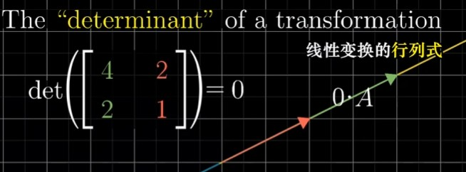

行列式的本质,实际上就是测量变换矩阵对原空间拉伸或挤压了多少?

如上图的行列式,就等于0x1-(2x-1.5)=3,就表示改矩阵变换让原面积放大3倍

---

当行列式等于0,就说明没有面积,意味着空间被压缩到了更小维度

---

当行列式为负数,意味着空间发生了翻转,但是面积还是拉伸了5倍

想象红轴绕绿轴在三维空间旋转了180度,然后拉伸成如下图

---

下图准确的展示了行列式计算的集合分解

---

### 扩展到三维空间

三维空间行列式实际上跟上面的二维平面同理,只是在三维空间里进行拉伸缩放;

需要注意的一点是,但三位变换矩阵的行列式计算为负时,空间发生翻转,也就意味着空间取向在左手定则和右手定则间发生了变化!

